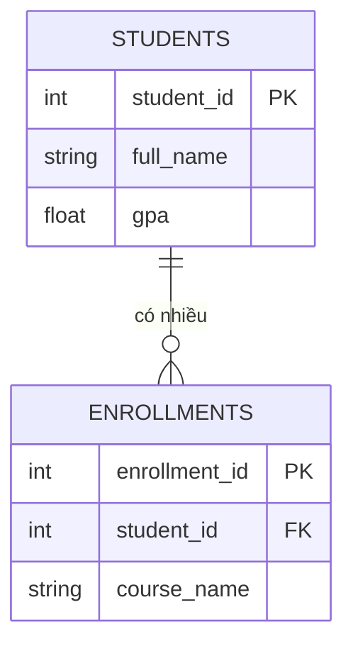

# 📘 Giai đoạn 1: Nền tảng dữ liệu quan hệ & SQL

> Quay lại: [Roadmap tổng quan](./roadmap-database-system-design.md)

## Mục lục
- [1.1 RDBMS là gì?](#11-rdbms-là-gì)
- [1.2 Table, Row, Column, Data Type](#12-table-row-column-data-type)
- [1.3 Primary Key & Foreign Key](#13-primary-key--foreign-key)
- [1.4 SELECT cơ bản](#14-select-cơ-bản)
- [1.5 JOIN — phần quan trọng nhất](#15-join--phần-quan-trọng-nhất)
- [1.6 GROUP BY, HAVING, Aggregate Functions](#16-group-by-having-aggregate-functions)
- [1.7 Subquery](#17-subquery)
- [1.8 INSERT / UPDATE / DELETE / CREATE / ALTER](#18-insert--update--delete--create--alter)
- [1.9 Bài tập thực hành](#19-bài-tập-thực-hành)
- [1.10 Tự kiểm tra trước khi qua Giai đoạn 2](#110-tự-kiểm-tra-trước-khi-qua-giai-đoạn-2)

---

## 1.1 RDBMS là gì?

**RDBMS (Relational Database Management System)** là hệ quản trị cơ sở dữ liệu quan hệ — nơi dữ liệu được lưu trong các **bảng (table)** có quan hệ với nhau, thay vì lưu lộn xộn một chỗ.

Ví dụ dễ hình dung: thay vì lưu "Đơn hàng của Nam gồm 3 sản phẩm..." trong 1 dòng text dài, ta tách thành 3 bảng: `customers`, `orders`, `order_items` — và liên kết chúng bằng khóa (key).

**Vì sao tách bảng thay vì lưu chung 1 bảng?**
- Tránh **lặp dữ liệu** (nếu 1 khách mua 10 đơn, không phải lặp lại tên/địa chỉ khách 10 lần)
- Dễ **cập nhật** (sửa địa chỉ khách 1 chỗ, không phải sửa 10 chỗ)
- Dữ liệu **nhất quán** hơn

Các RDBMS phổ biến: PostgreSQL, MySQL, SQL Server, Oracle, SQLite.

---

## 1.2 Table, Row, Column, Data Type

Một bảng `students`:

| student_id | full_name  | birth_date | gpa  |
|-----------:|------------|------------|------|
| 1          | Nguyễn Văn A | 2001-05-12 | 3.4  |
| 2          | Trần Thị B   | 2002-08-20 | 3.8  |

- **Row (hàng)** = 1 bản ghi, ví dụ 1 sinh viên
- **Column (cột)** = 1 thuộc tính, ví dụ `full_name`, `gpa`
- **Data Type (kiểu dữ liệu)** phổ biến:
  - `INT` / `BIGINT` — số nguyên
  - `VARCHAR(n)` / `TEXT` — chuỗi ký tự
  - `DATE` / `TIMESTAMP` — ngày giờ
  - `DECIMAL(p,s)` / `NUMERIC` — số thập phân chính xác (dùng cho tiền tệ)
  - `BOOLEAN` — true/false

> ⚠️ Lưu ý thường gặp: **không dùng `FLOAT` cho tiền tệ** vì sai số làm tròn. Dùng `DECIMAL(10,2)`.

---

## 1.3 Primary Key & Foreign Key

- **Primary Key (PK)** — khóa chính, giá trị **duy nhất**, xác định 1 hàng cụ thể trong bảng. Ví dụ `student_id`.
- **Foreign Key (FK)** — khóa ngoại, là cột tham chiếu đến Primary Key của bảng khác, dùng để tạo **quan hệ** giữa các bảng.

```sql
CREATE TABLE students (
    student_id SERIAL PRIMARY KEY,
    full_name  VARCHAR(100) NOT NULL,
    birth_date DATE
);

CREATE TABLE enrollments (
    enrollment_id SERIAL PRIMARY KEY,
    student_id INT REFERENCES students(student_id), -- Foreign Key
    course_name VARCHAR(100),
    enrolled_at DATE DEFAULT CURRENT_DATE
);
```

`enrollments.student_id` là khóa ngoại trỏ về `students.student_id` → đây chính là cách 2 bảng "biết nhau".

---

## 1.4 SELECT cơ bản

```sql
-- Lấy tất cả cột
SELECT * FROM students;

-- Lấy cột cụ thể
SELECT full_name, gpa FROM students;

-- Lọc điều kiện
SELECT full_name FROM students WHERE gpa >= 3.5;

-- Sắp xếp
SELECT full_name, gpa FROM students ORDER BY gpa DESC;

-- Giới hạn số dòng
SELECT full_name FROM students ORDER BY gpa DESC LIMIT 5;

-- Nhiều điều kiện
SELECT full_name FROM students
WHERE gpa >= 3.0 AND birth_date > '2001-01-01';
```

---

## 1.5 JOIN — phần quan trọng nhất

Giả sử có 2 bảng liên quan:



### INNER JOIN — chỉ lấy dòng khớp ở cả 2 bảng
```sql
SELECT s.full_name, e.course_name
FROM students s
INNER JOIN enrollments e ON s.student_id = e.student_id;
```

### LEFT JOIN — lấy hết bảng trái, kể cả không có dữ liệu khớp bên phải
```sql
-- Lấy TẤT CẢ sinh viên, kể cả chưa đăng ký môn nào (course_name sẽ là NULL)
SELECT s.full_name, e.course_name
FROM students s
LEFT JOIN enrollments e ON s.student_id = e.student_id;
```

### RIGHT JOIN — ngược lại LEFT JOIN (ít dùng hơn, thường viết lại thành LEFT JOIN cho dễ đọc)

### FULL OUTER JOIN — lấy hết cả 2 bên, khớp hoặc không khớp đều lấy

> 💡 Mẹo nhớ: **INNER = giao nhau**, **LEFT = ưu tiên giữ hết bảng trái**, **FULL OUTER = giữ hết cả 2**.

---

## 1.6 GROUP BY, HAVING, Aggregate Functions

```sql
-- Đếm số sinh viên đăng ký mỗi môn
SELECT course_name, COUNT(*) AS total_students
FROM enrollments
GROUP BY course_name;

-- Chỉ lấy môn có từ 10 sinh viên trở lên
SELECT course_name, COUNT(*) AS total_students
FROM enrollments
GROUP BY course_name
HAVING COUNT(*) >= 10;

-- Các hàm aggregate phổ biến: COUNT, SUM, AVG, MIN, MAX
SELECT AVG(gpa) AS avg_gpa, MAX(gpa) AS top_gpa FROM students;
```

> ⚠️ Phân biệt: `WHERE` lọc **trước khi** gom nhóm, `HAVING` lọc **sau khi** gom nhóm (trên kết quả aggregate).

---

## 1.7 Subquery

```sql
-- Tìm sinh viên có GPA cao hơn GPA trung bình
SELECT full_name, gpa
FROM students
WHERE gpa > (SELECT AVG(gpa) FROM students);

-- Subquery trong FROM
SELECT course_name, total_students
FROM (
    SELECT course_name, COUNT(*) AS total_students
    FROM enrollments
    GROUP BY course_name
) AS course_stats
WHERE total_students > 5;
```

---

## 1.8 INSERT / UPDATE / DELETE / CREATE / ALTER

```sql
-- Thêm dữ liệu
INSERT INTO students (full_name, birth_date, gpa)
VALUES ('Lê Văn C', '2003-01-15', 3.6);

-- Cập nhật dữ liệu
UPDATE students SET gpa = 3.9 WHERE student_id = 1;

-- Xóa dữ liệu
DELETE FROM students WHERE student_id = 3;

-- Tạo bảng mới
CREATE TABLE courses (
    course_id SERIAL PRIMARY KEY,
    course_name VARCHAR(100) NOT NULL
);

-- Sửa cấu trúc bảng
ALTER TABLE students ADD COLUMN email VARCHAR(100);
```

> ⚠️ **Luôn có `WHERE` khi UPDATE/DELETE**, nếu không sẽ áp dụng cho toàn bộ bảng!

---

## 1.9 Bài tập thực hành

Dùng schema `students` + `enrollments` ở trên, hãy tự viết SQL cho các yêu cầu sau (không xem đáp án trước):

1. Lấy danh sách sinh viên có GPA từ 3.5 trở lên, sắp xếp giảm dần theo GPA
2. Đếm số môn học mà mỗi sinh viên đã đăng ký (dùng JOIN + GROUP BY)
3. Tìm những sinh viên **chưa đăng ký môn nào** (gợi ý: LEFT JOIN + WHERE ... IS NULL)
4. Tính GPA trung bình của toàn bộ sinh viên
5. Tìm môn học có nhiều sinh viên đăng ký nhất

<details>
<summary>👉 Bấm để xem đáp án gợi ý</summary>

```sql
-- 1.
SELECT full_name, gpa FROM students WHERE gpa >= 3.5 ORDER BY gpa DESC;

-- 2.
SELECT s.full_name, COUNT(e.enrollment_id) AS so_mon
FROM students s
LEFT JOIN enrollments e ON s.student_id = e.student_id
GROUP BY s.full_name;

-- 3.
SELECT s.full_name
FROM students s
LEFT JOIN enrollments e ON s.student_id = e.student_id
WHERE e.enrollment_id IS NULL;

-- 4.
SELECT AVG(gpa) FROM students;

-- 5.
SELECT course_name, COUNT(*) AS total
FROM enrollments
GROUP BY course_name
ORDER BY total DESC
LIMIT 1;
```
</details>

---

## 1.10 Tự kiểm tra trước khi qua Giai đoạn 2

Bạn đã sẵn sàng nếu tự trả lời "Có" cho tất cả:

- [ ] Tôi giải thích được PK và FK khác nhau như thế nào
- [ ] Tôi phân biệt được INNER JOIN và LEFT JOIN mà không cần tra cứu
- [ ] Tôi biết khi nào dùng WHERE, khi nào dùng HAVING
- [ ] Tôi tự viết được 1 subquery để lọc dữ liệu theo giá trị tổng hợp (aggregate)
- [ ] Tôi làm được cả 5 bài tập trên **mà không xem đáp án trước**

Nếu còn mục nào chưa chắc, quay lại luyện thêm trên [SQLBolt](https://sqlbolt.com/) trước khi tiếp tục.

➡️ Tiếp theo: [Giai đoạn 2 — Mô hình hóa dữ liệu](./02-mo-hinh-hoa-du-lieu.md)
