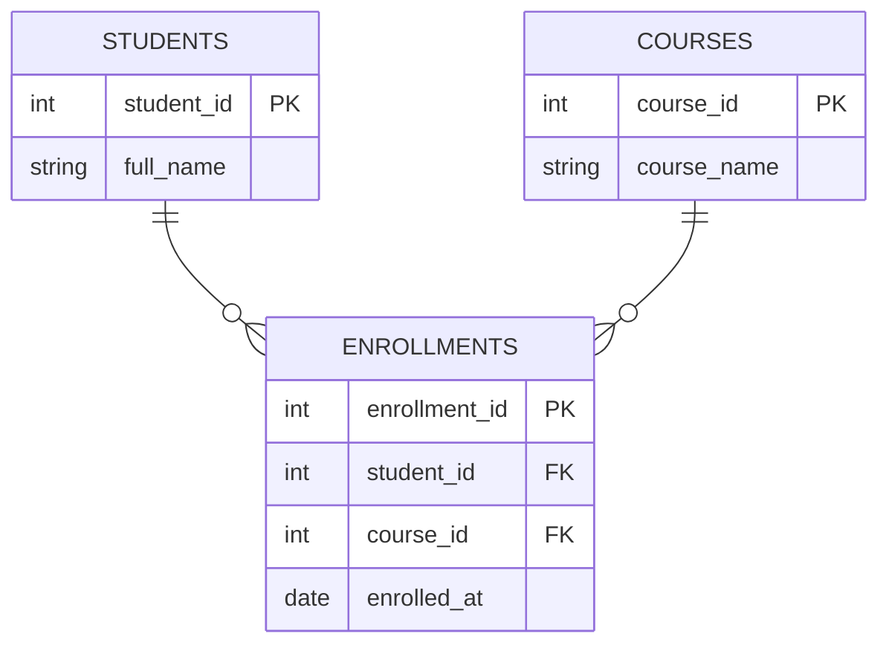
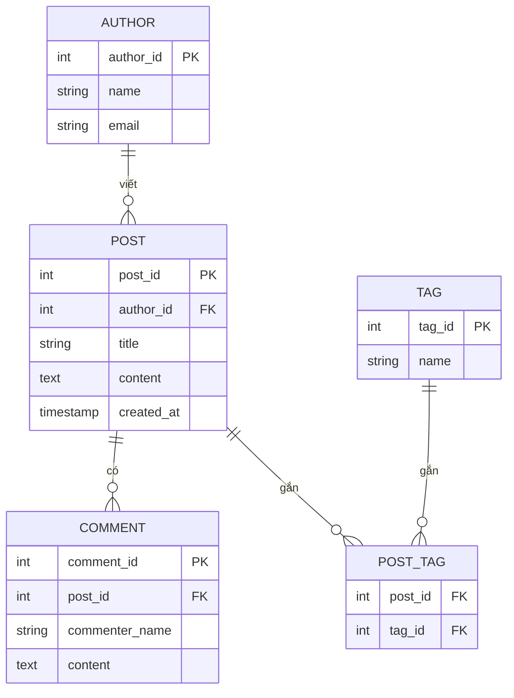
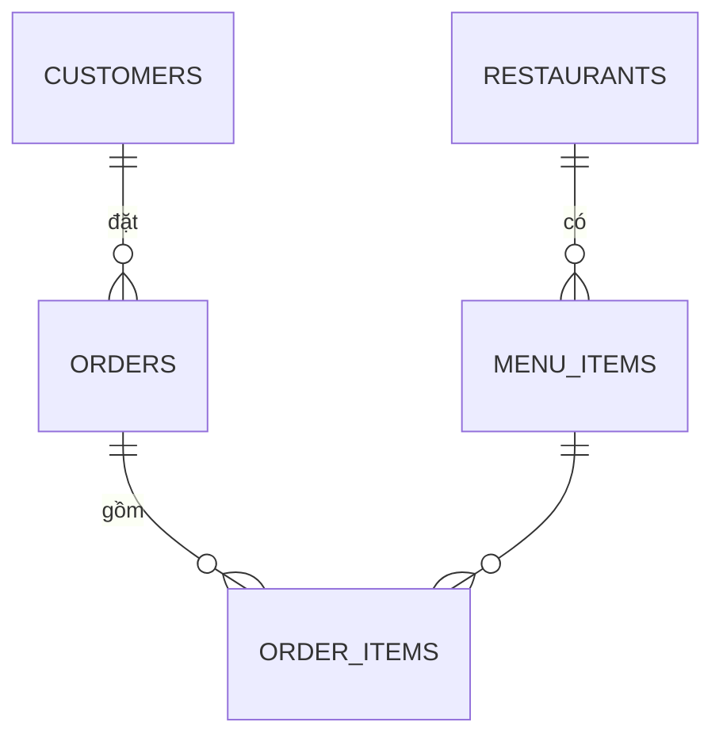

# 📘 Giai đoạn 2: Mô hình hóa dữ liệu (Data Modeling)

> Quay lại: [Roadmap tổng quan](./roadmap-database-system-design.md) | Trước đó: [Giai đoạn 1 — Nền tảng SQL](./01-nen-tang-sql.md)

## Mục lục
- [2.1 Entity, Attribute, Relationship là gì](#21-entity-attribute-relationship-là-gì)
- [2.2 Cardinality (1-1, 1-n, n-n)](#22-cardinality-1-1-1-n-n-n)
- [2.3 Ví dụ phân tích từ đầu: Hệ thống Blog](#23-ví-dụ-phân-tích-từ-đầu-hệ-thống-blog)
- [2.4 Chuẩn hóa dữ liệu (Normalization)](#24-chuẩn-hóa-dữ-liệu-normalization)
- [2.5 Khi nào nên Denormalize](#25-khi-nào-nên-denormalize)
- [2.6 Các ràng buộc dữ liệu (Constraints)](#26-các-ràng-buộc-dữ-liệu-constraints)
- [2.7 Bài tập thực hành](#27-bài-tập-thực-hành)
- [2.8 Tự kiểm tra trước khi qua Giai đoạn 3](#28-tự-kiểm-tra-trước-khi-qua-giai-đoạn-3)

---

## 2.1 Entity, Attribute, Relationship là gì

Đây là 3 khái niệm gốc của mô hình hóa dữ liệu:

- **Entity (thực thể)** — một "đối tượng" trong hệ thống mà bạn cần lưu trữ thông tin. Ví dụ: `Sinh viên`, `Sản phẩm`, `Đơn hàng`. Sau này mỗi entity thường thành 1 bảng.
- **Attribute (thuộc tính)** — đặc điểm mô tả entity đó. Ví dụ entity `Sản phẩm` có attribute: tên, giá, mô tả.
- **Relationship (mối quan hệ)** — cách 2 entity liên kết với nhau. Ví dụ: `Khách hàng` **đặt** `Đơn hàng`.

**Cách xác định entity từ 1 bài toán:** đọc mô tả nghiệp vụ, gạch chân các **danh từ chính** — đó thường là entity ứng viên. Các **động từ liên kết 2 danh từ** — đó thường là relationship.

> Ví dụ câu mô tả: *"Khách hàng đặt nhiều đơn hàng, mỗi đơn hàng gồm nhiều sản phẩm."*
> → Entity: `Khách hàng`, `Đơn hàng`, `Sản phẩm`
> → Relationship: Khách hàng — đặt → Đơn hàng; Đơn hàng — chứa → Sản phẩm

---

## 2.2 Cardinality (1-1, 1-n, n-n)

| Loại quan hệ | Ý nghĩa | Ví dụ |
|---|---|---|
| **1-1** | 1 bản ghi bên A khớp đúng 1 bản ghi bên B | 1 `User` có đúng 1 `UserProfile` |
| **1-n** | 1 bản ghi bên A có nhiều bản ghi bên B, nhưng B chỉ thuộc 1 A | 1 `Khách hàng` có nhiều `Đơn hàng` |
| **n-n** | Nhiều bản ghi A liên kết nhiều bản ghi B | 1 `Sinh viên` học nhiều `Môn học`, 1 `Môn học` có nhiều `Sinh viên` |

**Quan trọng:** Quan hệ **n-n không thể lưu trực tiếp** bằng 1 FK — bắt buộc phải tạo **bảng trung gian (junction table / bridge table)**.



`ENROLLMENTS` chính là bảng trung gian giải quyết quan hệ n-n giữa `STUDENTS` và `COURSES`.

---

## 2.3 Ví dụ phân tích từ đầu: Hệ thống Blog

**Yêu cầu nghiệp vụ:**
> "Xây dựng hệ thống blog. Mỗi tác giả viết nhiều bài viết. Mỗi bài viết có thể có nhiều bình luận từ độc giả. Mỗi bài viết có thể gắn nhiều thẻ (tag), và mỗi thẻ có thể gắn cho nhiều bài viết."

**Bước 1 — Xác định Entity:** `Author`, `Post`, `Comment`, `Tag`

**Bước 2 — Xác định Relationship & Cardinality:**
- Author 1—n Post (1 tác giả viết nhiều bài)
- Post 1—n Comment (1 bài có nhiều bình luận)
- Post n—n Tag (cần bảng trung gian `post_tags`)

**Bước 3 — ERD:**



**Bước 4 — SQL Schema:**
```sql
CREATE TABLE authors (
    author_id SERIAL PRIMARY KEY,
    name VARCHAR(100) NOT NULL,
    email VARCHAR(150) UNIQUE
);

CREATE TABLE posts (
    post_id SERIAL PRIMARY KEY,
    author_id INT NOT NULL REFERENCES authors(author_id),
    title VARCHAR(200) NOT NULL,
    content TEXT,
    created_at TIMESTAMP DEFAULT NOW()
);

CREATE TABLE comments (
    comment_id SERIAL PRIMARY KEY,
    post_id INT NOT NULL REFERENCES posts(post_id),
    commenter_name VARCHAR(100),
    content TEXT
);

CREATE TABLE tags (
    tag_id SERIAL PRIMARY KEY,
    name VARCHAR(50) UNIQUE NOT NULL
);

CREATE TABLE post_tags (
    post_id INT REFERENCES posts(post_id),
    tag_id INT REFERENCES tags(tag_id),
    PRIMARY KEY (post_id, tag_id)  -- khóa chính kép, tránh gắn trùng tag
);
```

---

## 2.4 Chuẩn hóa dữ liệu (Normalization)

Mục tiêu: **loại bỏ dư thừa dữ liệu** và **tránh bất thường khi cập nhật (update anomaly)**.

### Ví dụ bảng CHƯA chuẩn hóa (vi phạm):
| order_id | customer_name | customer_email | product | qty |
|---|---|---|---|---|
| 1 | Nam | nam@mail.com | Bàn phím | 2 |
| 2 | Nam | nam@mail.com | Chuột | 1 |

→ Vấn đề: email của "Nam" bị **lặp lại**. Nếu Nam đổi email, phải sửa nhiều dòng → dễ sai lệch dữ liệu.

### 1NF (First Normal Form)
Mỗi ô chỉ chứa **1 giá trị đơn** (không chứa danh sách/mảng trong 1 ô).

### 2NF (Second Normal Form)
Đạt 1NF + **mọi cột không khóa phải phụ thuộc vào TOÀN BỘ khóa chính** (áp dụng khi khóa chính gồm nhiều cột).

### 3NF (Third Normal Form)
Đạt 2NF + **không có phụ thuộc bắc cầu** (cột không khóa phụ thuộc vào cột không khóa khác, thay vì phụ thuộc trực tiếp vào khóa chính).

### Áp dụng chuẩn hóa cho ví dụ trên → tách thành 3 bảng:
```sql
CREATE TABLE customers (
    customer_id SERIAL PRIMARY KEY,
    name VARCHAR(100),
    email VARCHAR(150)
);

CREATE TABLE orders (
    order_id SERIAL PRIMARY KEY,
    customer_id INT REFERENCES customers(customer_id)
);

CREATE TABLE order_items (
    order_item_id SERIAL PRIMARY KEY,
    order_id INT REFERENCES orders(order_id),
    product VARCHAR(100),
    qty INT
);
```
→ Giờ email chỉ lưu **1 lần duy nhất** ở bảng `customers`.

---

## 2.5 Khi nào nên Denormalize

Chuẩn hóa giúp dữ liệu sạch, nhưng **càng nhiều bảng → càng nhiều JOIN → càng chậm** khi dữ liệu lớn.

**Denormalize khi:**
- Hệ thống đọc (read) nhiều hơn ghi (write) rất nhiều, và cần tốc độ đọc cao (VD: dashboard thống kê)
- Chấp nhận lưu dư 1 phần dữ liệu (VD: lưu sẵn `total_price` trong bảng `orders` thay vì tính lại từ `order_items` mỗi lần)

> Nguyên tắc chung: **luôn chuẩn hóa trước**, chỉ denormalize khi đo được vấn đề hiệu năng thật sự — đừng tối ưu sớm khi chưa cần.

---

## 2.6 Các ràng buộc dữ liệu (Constraints)

```sql
CREATE TABLE products (
    product_id SERIAL PRIMARY KEY,
    name VARCHAR(100) NOT NULL,          -- bắt buộc có giá trị
    sku VARCHAR(50) UNIQUE,              -- không được trùng
    price DECIMAL(10,2) CHECK (price >= 0), -- ràng buộc điều kiện
    stock INT DEFAULT 0                  -- giá trị mặc định
);
```

- `NOT NULL` — không được để trống
- `UNIQUE` — giá trị không được trùng lặp
- `CHECK` — ràng buộc điều kiện logic
- `DEFAULT` — giá trị mặc định nếu không truyền vào

---

## 2.7 Bài tập thực hành

**Đề bài:** Phân tích và thiết kế database cho hệ thống sau (tự làm trước khi xem gợi ý):

> "Ứng dụng đặt món ăn. Mỗi nhà hàng có nhiều món ăn trong thực đơn. Khách hàng có thể đặt 1 đơn hàng gồm nhiều món ăn (có thể từ nhiều nhà hàng khác nhau hoặc chỉ 1 nhà hàng tùy bạn quyết định). Mỗi đơn hàng có trạng thái (đang xử lý, đang giao, đã giao)."

Yêu cầu:
1. Liệt kê các entity
2. Xác định cardinality giữa các entity
3. Vẽ ERD (dùng mermaid hoặc dbdiagram.io)
4. Viết SQL schema hoàn chỉnh, có normalize tới 3NF

<details>
<summary>👉 Gợi ý đáp án</summary>

**Entities:** `restaurants`, `menu_items`, `customers`, `orders`, `order_items`



```sql
CREATE TABLE restaurants (
    restaurant_id SERIAL PRIMARY KEY,
    name VARCHAR(100) NOT NULL
);

CREATE TABLE menu_items (
    menu_item_id SERIAL PRIMARY KEY,
    restaurant_id INT REFERENCES restaurants(restaurant_id),
    name VARCHAR(100),
    price DECIMAL(10,2) CHECK (price >= 0)
);

CREATE TABLE customers (
    customer_id SERIAL PRIMARY KEY,
    name VARCHAR(100),
    phone VARCHAR(20)
);

CREATE TABLE orders (
    order_id SERIAL PRIMARY KEY,
    customer_id INT REFERENCES customers(customer_id),
    status VARCHAR(20) DEFAULT 'processing'
        CHECK (status IN ('processing','delivering','delivered')),
    created_at TIMESTAMP DEFAULT NOW()
);

CREATE TABLE order_items (
    order_item_id SERIAL PRIMARY KEY,
    order_id INT REFERENCES orders(order_id),
    menu_item_id INT REFERENCES menu_items(menu_item_id),
    quantity INT DEFAULT 1
);
```
</details>

---

## 2.8 Tự kiểm tra trước khi qua Giai đoạn 3

- [ ] Tôi tự xác định được entity từ 1 đoạn mô tả nghiệp vụ mà không cần gợi ý
- [ ] Tôi phân biệt được quan hệ 1-n và n-n, và biết n-n cần bảng trung gian
- [ ] Tôi giải thích được vì sao 1NF/2NF/3NF quan trọng bằng ví dụ cụ thể
- [ ] Tôi biết ít nhất 1 trường hợp nên denormalize
- [ ] Tôi làm được bài tập "ứng dụng đặt món ăn" và tự vẽ ERD trước khi xem gợi ý

➡️ Tiếp theo: [Giai đoạn 3 — Thực hành thiết kế database thực tế](./03-thuc-hanh-thiet-ke-db.md)
