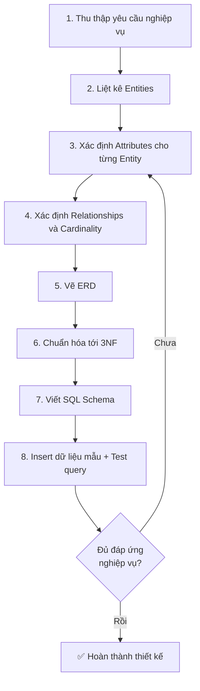
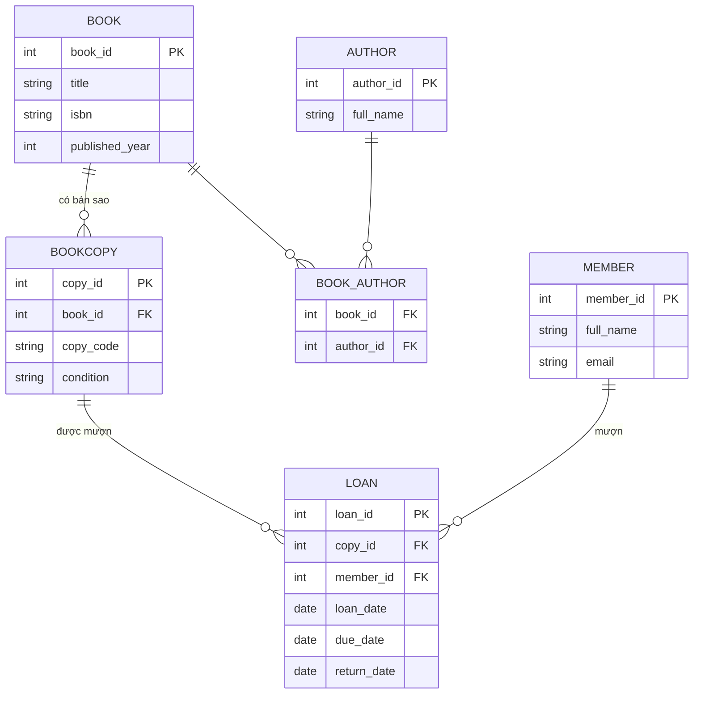

# 📘 Giai đoạn 3: Thực hành thiết kế Database thực tế

> Quay lại: [Roadmap tổng quan](./roadmap-database-system-design.md) | Trước đó: [Giai đoạn 2 — Mô hình hóa dữ liệu](./02-mo-hinh-hoa-du-lieu.md)

## Mục lục
- [3.1 Quy trình chuẩn phân tích → thiết kế](#31-quy-trình-chuẩn-phân-tích--thiết-kế)
- [3.2 Walkthrough đầy đủ: Hệ thống quản lý thư viện](#32-walkthrough-đầy-đủ-hệ-thống-quản-lý-thư-viện)
- [3.3 Dự án tự làm: Hệ thống bán hàng online](#33-dự-án-tự-làm-hệ-thống-bán-hàng-online)
- [3.4 Lỗi thường gặp khi mới thiết kế DB](#34-lỗi-thường-gặp-khi-mới-thiết-kế-db)
- [3.5 Tự kiểm tra trước khi qua Giai đoạn 4](#35-tự-kiểm-tra-trước-khi-qua-giai-đoạn-4)

---

## 3.1 Quy trình chuẩn phân tích → thiết kế



**Lưu ý quan trọng:** Thiết kế database **không phải quy trình 1 chiều** — bạn sẽ quay lại chỉnh sửa nhiều lần khi phát hiện thiếu sót. Đó là chuyện bình thường, kể cả với người có kinh nghiệm.

---

## 3.2 Walkthrough đầy đủ: Hệ thống quản lý thư viện

### Bước 1: Yêu cầu nghiệp vụ
> "Thư viện quản lý sách. Mỗi sách có thể có nhiều bản sao (copy) vật lý. Độc giả có thể mượn 1 hoặc nhiều bản sao sách, mỗi lượt mượn có ngày mượn và ngày trả dự kiến. Một cuốn sách có thể có nhiều tác giả, và 1 tác giả có thể viết nhiều sách."

### Bước 2: Liệt kê Entity
`Book`, `BookCopy`, `Author`, `Member` (độc giả), `Loan` (lượt mượn)

### Bước 3 & 4: Attribute + Relationship

| Entity | Attributes chính | Relationship |
|---|---|---|
| Book | title, isbn, published_year | n-n với Author |
| BookCopy | copy_code, condition | 1-n với Book (1 sách có nhiều bản sao) |
| Author | full_name | n-n với Book |
| Member | full_name, email, phone | 1-n với Loan |
| Loan | loan_date, due_date, return_date | 1-n với BookCopy, 1-n với Member |

### Bước 5: ERD



### Bước 6 & 7: Chuẩn hóa + SQL Schema

```sql
CREATE TABLE books (
    book_id SERIAL PRIMARY KEY,
    title VARCHAR(200) NOT NULL,
    isbn VARCHAR(20) UNIQUE,
    published_year INT
);

CREATE TABLE authors (
    author_id SERIAL PRIMARY KEY,
    full_name VARCHAR(100) NOT NULL
);

CREATE TABLE book_authors (
    book_id INT REFERENCES books(book_id),
    author_id INT REFERENCES authors(author_id),
    PRIMARY KEY (book_id, author_id)
);

CREATE TABLE book_copies (
    copy_id SERIAL PRIMARY KEY,
    book_id INT NOT NULL REFERENCES books(book_id),
    copy_code VARCHAR(30) UNIQUE NOT NULL,
    condition VARCHAR(20) DEFAULT 'good'
);

CREATE TABLE members (
    member_id SERIAL PRIMARY KEY,
    full_name VARCHAR(100) NOT NULL,
    email VARCHAR(150) UNIQUE,
    phone VARCHAR(20)
);

CREATE TABLE loans (
    loan_id SERIAL PRIMARY KEY,
    copy_id INT NOT NULL REFERENCES book_copies(copy_id),
    member_id INT NOT NULL REFERENCES members(member_id),
    loan_date DATE DEFAULT CURRENT_DATE,
    due_date DATE NOT NULL,
    return_date DATE  -- NULL nghĩa là chưa trả
);
```

### Bước 8: Test query thực tế

```sql
-- Danh sách sách đang được mượn (chưa trả) và ai đang mượn
SELECT b.title, m.full_name, l.due_date
FROM loans l
JOIN book_copies bc ON l.copy_id = bc.copy_id
JOIN books b ON bc.book_id = b.book_id
JOIN members m ON l.member_id = m.member_id
WHERE l.return_date IS NULL;

-- Danh sách sách đã QUÁ HẠN trả
SELECT b.title, m.full_name, l.due_date
FROM loans l
JOIN book_copies bc ON l.copy_id = bc.copy_id
JOIN books b ON bc.book_id = b.book_id
JOIN members m ON l.member_id = m.member_id
WHERE l.return_date IS NULL AND l.due_date < CURRENT_DATE;

-- Tác giả nào có nhiều sách nhất
SELECT a.full_name, COUNT(*) AS total_books
FROM book_authors ba
JOIN authors a ON ba.author_id = a.author_id
GROUP BY a.full_name
ORDER BY total_books DESC;
```

---

## 3.3 Dự án tự làm: Hệ thống bán hàng online

Bây giờ đến lượt bạn tự làm toàn bộ quy trình 8 bước ở trên, **không xem gợi ý cho đến khi làm xong**.

**Yêu cầu nghiệp vụ:**
> "Xây dựng database cho shop bán hàng online. Sản phẩm thuộc về 1 danh mục (category). Khách hàng đăng ký tài khoản, có thể có nhiều địa chỉ giao hàng. Khách đặt đơn hàng gồm nhiều sản phẩm với số lượng khác nhau. Mỗi đơn hàng có 1 địa chỉ giao hàng cụ thể, 1 trạng thái, và tổng tiền. Sản phẩm có thể được đánh giá (review) bởi khách hàng đã mua."

Tự làm theo checklist:
1. [ ] Liệt kê entity
2. [ ] Xác định attribute cho từng entity
3. [ ] Xác định relationship & cardinality
4. [ ] Vẽ ERD bằng mermaid hoặc dbdiagram.io
5. [ ] Viết SQL schema (nhớ chuẩn hóa, thêm constraint hợp lý)
6. [ ] Viết ít nhất 3 câu query kiểm tra nghiệp vụ (VD: doanh thu theo danh mục, sản phẩm bán chạy nhất...)

<details>
<summary>👉 Gợi ý đáp án đầy đủ (chỉ xem sau khi đã tự làm)</summary>

**Entities:** `categories`, `products`, `customers`, `addresses`, `orders`, `order_items`, `reviews`

```sql
CREATE TABLE categories (
    category_id SERIAL PRIMARY KEY,
    name VARCHAR(100) NOT NULL
);

CREATE TABLE products (
    product_id SERIAL PRIMARY KEY,
    category_id INT REFERENCES categories(category_id),
    name VARCHAR(150) NOT NULL,
    price DECIMAL(10,2) CHECK (price >= 0),
    stock INT DEFAULT 0
);

CREATE TABLE customers (
    customer_id SERIAL PRIMARY KEY,
    full_name VARCHAR(100) NOT NULL,
    email VARCHAR(150) UNIQUE NOT NULL
);

CREATE TABLE addresses (
    address_id SERIAL PRIMARY KEY,
    customer_id INT REFERENCES customers(customer_id),
    address_line VARCHAR(255),
    city VARCHAR(100),
    is_default BOOLEAN DEFAULT FALSE
);

CREATE TABLE orders (
    order_id SERIAL PRIMARY KEY,
    customer_id INT REFERENCES customers(customer_id),
    address_id INT REFERENCES addresses(address_id),
    status VARCHAR(20) DEFAULT 'pending',
    total_amount DECIMAL(12,2) DEFAULT 0,
    created_at TIMESTAMP DEFAULT NOW()
);

CREATE TABLE order_items (
    order_item_id SERIAL PRIMARY KEY,
    order_id INT REFERENCES orders(order_id),
    product_id INT REFERENCES products(product_id),
    quantity INT NOT NULL CHECK (quantity > 0),
    unit_price DECIMAL(10,2) NOT NULL  -- lưu giá tại thời điểm mua
);

CREATE TABLE reviews (
    review_id SERIAL PRIMARY KEY,
    product_id INT REFERENCES products(product_id),
    customer_id INT REFERENCES customers(customer_id),
    rating INT CHECK (rating BETWEEN 1 AND 5),
    comment TEXT,
    created_at TIMESTAMP DEFAULT NOW()
);
```

**Câu hỏi tự phản biện:** Vì sao `order_items` cần lưu `unit_price` riêng thay vì lấy `price` trực tiếp từ bảng `products`?
→ *Vì giá sản phẩm có thể thay đổi theo thời gian — đơn hàng cũ phải giữ đúng giá đã bán, không bị ảnh hưởng khi sản phẩm đổi giá sau này.*

**Query mẫu:**
```sql
-- Doanh thu theo danh mục
SELECT c.name, SUM(oi.quantity * oi.unit_price) AS revenue
FROM order_items oi
JOIN products p ON oi.product_id = p.product_id
JOIN categories c ON p.category_id = c.category_id
GROUP BY c.name
ORDER BY revenue DESC;

-- Sản phẩm bán chạy nhất
SELECT p.name, SUM(oi.quantity) AS total_sold
FROM order_items oi
JOIN products p ON oi.product_id = p.product_id
GROUP BY p.name
ORDER BY total_sold DESC
LIMIT 10;

-- Rating trung bình mỗi sản phẩm
SELECT p.name, ROUND(AVG(r.rating), 2) AS avg_rating
FROM reviews r
JOIN products p ON r.product_id = p.product_id
GROUP BY p.name;
```
</details>

---

## 3.4 Lỗi thường gặp khi mới thiết kế DB

| Lỗi | Vì sao sai | Cách sửa |
|---|---|---|
| Nhét nhiều giá trị vào 1 cột (VD: `tags = "sale,new,hot"`) | Vi phạm 1NF, khó query/lọc | Tách bảng riêng (VD: `product_tags`) |
| Không lưu giá tại thời điểm giao dịch | Đơn hàng cũ bị sai khi giá SP đổi | Thêm cột `unit_price` snapshot trong `order_items` |
| Dùng tên/email làm khóa chính | Dữ liệu này có thể trùng hoặc thay đổi | Luôn dùng ID tự tăng (surrogate key) làm PK |
| Không đặt FK constraint | Dữ liệu rác, mất liên kết mà không báo lỗi | Luôn khai báo `REFERENCES` |
| Thiết kế bảng "God table" chứa mọi thứ | Khó maintain, vi phạm chuẩn hóa | Tách theo entity rõ ràng |

---

## 3.5 Tự kiểm tra trước khi qua Giai đoạn 4

- [ ] Tôi tự thực hiện được đầy đủ 8 bước quy trình cho 1 bài toán mới, không cần nhìn mẫu
- [ ] Tôi hoàn thành bài tập "hệ thống bán hàng online" và thiết kế ra tối thiểu 6 bảng hợp lý
- [ ] Tôi giải thích được vì sao cần lưu `unit_price` snapshot trong đơn hàng
- [ ] Tôi nhận diện được ít nhất 3 lỗi thiết kế phổ biến ở trên trong 1 schema cho sẵn
- [ ] Tôi viết được query JOIN qua 3-4 bảng để trả lời câu hỏi nghiệp vụ (VD: doanh thu, thống kê)

➡️ Tiếp theo: [Giai đoạn 4 — Kiến thức nâng cao về DBMS](./04-dbms-nang-cao.md)
