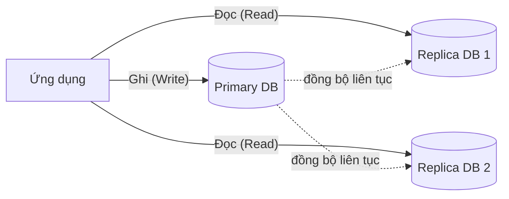

# 📘 Giai đoạn 4: Kiến thức nâng cao về DBMS

> Quay lại: [Roadmap tổng quan](./roadmap-database-system-design.md) | Trước đó: [Giai đoạn 3 — Thực hành thiết kế DB](./03-thuc-hanh-thiet-ke-db.md)

## Mục lục
- [4.1 Index — tại sao query nhanh hơn](#41-index--tại-sao-query-nhanh-hơn)
- [4.2 Transaction & ACID](#42-transaction--acid)
- [4.3 Isolation Levels](#43-isolation-levels)
- [4.4 Đọc EXPLAIN ANALYZE](#44-đọc-explain-analyze)
- [4.5 Backup & Replication cơ bản](#45-backup--replication-cơ-bản)
- [4.6 Bài tập thực hành](#46-bài-tập-thực-hành)
- [4.7 Tự kiểm tra trước khi qua Giai đoạn 5](#47-tự-kiểm-tra-trước-khi-qua-giai-đoạn-5)

---

## 4.1 Index — tại sao query nhanh hơn

**Vấn đề:** Không có index, database phải quét **toàn bộ bảng** (full table scan) để tìm dữ liệu — giống như đọc hết 1 cuốn sách để tìm 1 từ, thay vì tra mục lục.

**Index** giống mục lục sách — một cấu trúc dữ liệu (thường là B-Tree) giúp tìm nhanh mà không cần quét hết bảng.

```sql
-- Tạo index cho cột hay dùng để tìm kiếm/lọc
CREATE INDEX idx_students_gpa ON students(gpa);

-- Index cho cột hay dùng để JOIN
CREATE INDEX idx_enrollments_student_id ON enrollments(student_id);
```

**Khi nào NÊN đánh index:**
- Cột thường xuất hiện trong `WHERE`, `JOIN`, `ORDER BY`
- Cột có nhiều giá trị khác nhau (high cardinality) — VD: email, ID

**Khi nào KHÔNG NÊN đánh index:**
- Bảng nhỏ (vài trăm dòng) — quét hết cũng nhanh, index chỉ thêm overhead
- Cột ít giá trị khác nhau (VD: cột `gender` chỉ có 2 giá trị) — index không giúp nhiều
- Bảng ghi (INSERT/UPDATE) rất nhiều — vì mỗi lần ghi, index cũng phải cập nhật theo → chậm ghi

> 💡 Index là sự đánh đổi: **đọc nhanh hơn, nhưng ghi chậm hơn** và tốn thêm dung lượng lưu trữ.

---

## 4.2 Transaction & ACID

**Transaction** là 1 nhóm các thao tác được thực hiện như **1 khối duy nhất** — hoặc tất cả thành công, hoặc tất cả thất bại (rollback).

**Ví dụ kinh điển:** chuyển khoản ngân hàng — trừ tiền tài khoản A và cộng tiền tài khoản B phải **cùng thành công hoặc cùng thất bại**, không được để xảy ra tình huống trừ tiền A nhưng B không nhận được.

```sql
BEGIN;  -- bắt đầu transaction

UPDATE accounts SET balance = balance - 100 WHERE account_id = 1;
UPDATE accounts SET balance = balance + 100 WHERE account_id = 2;

COMMIT;  -- xác nhận, lưu thay đổi thật sự
-- Nếu có lỗi giữa chừng: ROLLBACK; để hủy toàn bộ thay đổi
```

### ACID là gì?

| Chữ | Ý nghĩa | Giải thích ngắn |
|---|---|---|
| **A**tomicity | Tính nguyên tử | Tất cả hoặc không gì cả — không có trạng thái "làm dở" |
| **C**onsistency | Tính nhất quán | Dữ liệu luôn đúng theo các ràng buộc đã định nghĩa (constraint) trước và sau transaction |
| **I**solation | Tính cô lập | Nhiều transaction chạy đồng thời không ảnh hưởng lẫn nhau |
| **D**urability | Tính bền vững | Sau khi COMMIT, dữ liệu được lưu vĩnh viễn dù hệ thống có sập ngay sau đó |

---

## 4.3 Isolation Levels

Khi nhiều transaction chạy **cùng lúc**, có thể xảy ra các vấn đề:
- **Dirty Read** — đọc dữ liệu chưa COMMIT của transaction khác (dữ liệu "bẩn", có thể bị rollback sau đó)
- **Non-repeatable Read** — đọc cùng 1 dòng 2 lần trong 1 transaction nhưng ra kết quả khác nhau
- **Phantom Read** — chạy cùng 1 query 2 lần nhưng số dòng trả về khác nhau

| Isolation Level | Chặn Dirty Read? | Chặn Non-repeatable Read? | Chặn Phantom Read? |
|---|---|---|---|
| Read Uncommitted | ❌ | ❌ | ❌ |
| Read Committed *(mặc định ở PostgreSQL)* | ✅ | ❌ | ❌ |
| Repeatable Read | ✅ | ✅ | ❌ |
| Serializable | ✅ | ✅ | ✅ |

> Mức cô lập càng cao → càng an toàn nhưng càng **giảm hiệu năng** (vì phải khóa (lock) dữ liệu nhiều hơn). Chọn mức phù hợp với nghiệp vụ, không phải lúc nào cũng cần Serializable.

---

## 4.4 Đọc EXPLAIN ANALYZE

```sql
EXPLAIN ANALYZE
SELECT * FROM students WHERE gpa > 3.5;
```

Kết quả trả về sẽ cho biết:
- Database dùng **Seq Scan** (quét toàn bảng) hay **Index Scan** (dùng index)
- Thời gian thực thi thực tế (actual time)
- Số dòng ước tính vs số dòng thực tế

**Cách đọc nhanh:**
- Thấy `Seq Scan` trên bảng lớn + query chạy chậm → cân nhắc thêm index
- Thấy `Index Scan` → tốt, đang tận dụng index
- So sánh thời gian trước/sau khi thêm index để xác nhận cải thiện

```sql
-- Trước khi có index: có thể thấy "Seq Scan on students"
-- Sau khi tạo index:
CREATE INDEX idx_gpa ON students(gpa);
-- Chạy lại EXPLAIN ANALYZE → nên thấy "Index Scan using idx_gpa"
```

---

## 4.5 Backup & Replication cơ bản

- **Backup** — sao lưu định kỳ để phòng mất dữ liệu (do lỗi người dùng, sự cố phần cứng...)
  - `pg_dump` (PostgreSQL) để export toàn bộ database ra file
  - Nên có chiến lược: backup hằng ngày + lưu trữ ở nơi khác server chính

- **Replication** — nhân bản dữ liệu sang server khác theo mô hình **Master-Slave (Primary-Replica)**
  - Server chính (Primary) nhận ghi (write)
  - Server phụ (Replica) chỉ đọc (read), đồng bộ liên tục từ Primary
  - Lợi ích: tăng khả năng chịu lỗi (failover), giảm tải đọc cho server chính



---

## 4.6 Bài tập thực hành

1. Tạo bảng `orders` với 100.000 dòng dữ liệu giả (hoặc dùng dữ liệu mẫu có sẵn), thử query `WHERE customer_id = X` trước và sau khi tạo index trên `customer_id`. So sánh kết quả `EXPLAIN ANALYZE`.
2. Viết 1 transaction mô phỏng việc đặt hàng: trừ `stock` trong bảng `products` và tạo dòng mới trong `orders` — đảm bảo nếu `stock` không đủ thì `ROLLBACK`.
3. Giải thích bằng lời (không cần code): tại sao 1 hệ thống bán vé sự kiện (nhiều người mua cùng lúc, vé có giới hạn) cần quan tâm đặc biệt đến Isolation Level?

<details>
<summary>👉 Gợi ý bài 2</summary>

```sql
BEGIN;

-- Kiểm tra và trừ kho, chỉ trừ nếu đủ hàng
UPDATE products
SET stock = stock - 1
WHERE product_id = 5 AND stock > 0;

-- Nếu không có dòng nào bị ảnh hưởng (hết hàng), phải rollback ở tầng ứng dụng
-- Giả sử đủ hàng, tiếp tục tạo đơn:
INSERT INTO orders (customer_id, product_id, quantity)
VALUES (10, 5, 1);

COMMIT;
```
Ở tầng ứng dụng (backend), bạn cần kiểm tra số dòng bị ảnh hưởng (`rowCount`) sau câu UPDATE — nếu bằng 0 (hết hàng) thì gọi `ROLLBACK` thay vì `COMMIT`.
</details>

---

## 4.7 Tự kiểm tra trước khi qua Giai đoạn 5

- [ ] Tôi giải thích được vì sao index giúp query nhanh hơn, bằng ví dụ không phải sách giáo khoa
- [ ] Tôi biết ít nhất 2 trường hợp KHÔNG nên đánh index
- [ ] Tôi giải thích được 4 chữ ACID bằng ví dụ thực tế của riêng mình
- [ ] Tôi phân biệt được Dirty Read và Non-repeatable Read
- [ ] Tôi đọc hiểu được kết quả `EXPLAIN ANALYZE` cơ bản (Seq Scan vs Index Scan)
- [ ] Tôi tự viết được 1 transaction có kiểm tra điều kiện trước khi COMMIT

➡️ Tiếp theo: [Giai đoạn 5 — Kết nối Database với Backend/API](./05-ket-noi-backend-api.md)
