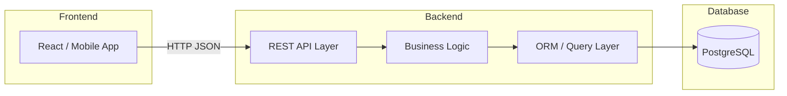

# 📘 Giai đoạn 5: Kết nối Database với Backend/API

> Quay lại: [Roadmap tổng quan](./roadmap-database-system-design.md) | Trước đó: [Giai đoạn 4 — DBMS nâng cao](./04-dbms-nang-cao.md)

## Mục lục
- [5.1 Kiến trúc 3 lớp](#51-kiến-trúc-3-lớp)
- [5.2 ORM là gì và vì sao nên dùng](#52-orm-là-gì-và-vì-sao-nên-dùng)
- [5.3 Ví dụ ORM với Prisma (Node.js)](#53-ví-dụ-orm-với-prisma-nodejs)
- [5.4 Xây REST API CRUD hoàn chỉnh](#54-xây-rest-api-crud-hoàn-chỉnh)
- [5.5 Khi nào nên viết raw SQL thay vì dùng ORM](#55-khi-nào-nên-viết-raw-sql-thay-vì-dùng-orm)
- [5.6 Bài tập thực hành](#56-bài-tập-thực-hành)
- [5.7 Tự kiểm tra trước khi qua Giai đoạn 6](#57-tự-kiểm-tra-trước-khi-qua-giai-đoạn-6)

---

## 5.1 Kiến trúc 3 lớp



- **Frontend** — nơi người dùng tương tác, gửi request
- **Backend/API** — nhận request, xử lý logic nghiệp vụ (validate, tính toán, phân quyền...), rồi giao tiếp với database
- **Database** — lưu trữ dữ liệu bền vững

**Nguyên tắc quan trọng:** Frontend **không bao giờ** kết nối trực tiếp vào database — luôn phải đi qua backend/API để kiểm soát bảo mật và logic nghiệp vụ.

---

## 5.2 ORM là gì và vì sao nên dùng

**ORM (Object-Relational Mapping)** là công cụ giúp bạn thao tác với database bằng code (JavaScript, Python...) thay vì viết SQL thuần.

**Không dùng ORM (raw SQL):**
```sql
SELECT * FROM products WHERE category_id = 3;
```

**Dùng ORM (ví dụ Prisma):**
```javascript
const products = await prisma.product.findMany({
  where: { categoryId: 3 }
});
```

**Lợi ích của ORM:**
- Code an toàn hơn (tự động chống SQL Injection)
- Làm việc với object thay vì chuỗi SQL → ít lỗi cú pháp
- Dễ đổi database (PostgreSQL → MySQL) mà ít phải sửa code
- Tự sinh migration (quản lý thay đổi schema theo thời gian)

**Hạn chế:**
- Với query phức tạp (nhiều JOIN, aggregate phức tạp), ORM có thể sinh ra SQL kém tối ưu
- Cần hiểu SQL nền tảng để debug khi ORM "làm sai ý"

---

## 5.3 Ví dụ ORM với Prisma (Node.js)

**Bước 1 — Định nghĩa schema** (`schema.prisma`):
```prisma
model Category {
  id       Int       @id @default(autoincrement())
  name     String
  products Product[]
}

model Product {
  id         Int      @id @default(autoincrement())
  name       String
  price      Decimal
  categoryId Int
  category   Category @relation(fields: [categoryId], references: [id])
}
```

**Bước 2 — Chạy migration** (tự tạo bảng trong database):
```bash
npx prisma migrate dev --name init
```

**Bước 3 — Dùng trong code:**
```javascript
// Tạo mới
const product = await prisma.product.create({
  data: { name: "Bàn phím cơ", price: 590000, categoryId: 1 }
});

// Lấy kèm quan hệ (giống JOIN)
const productsWithCategory = await prisma.product.findMany({
  include: { category: true }
});

// Cập nhật
await prisma.product.update({
  where: { id: 1 },
  data: { price: 550000 }
});

// Xóa
await prisma.product.delete({ where: { id: 1 } });
```

> So sánh: `include: { category: true }` ở trên tương đương với việc viết `JOIN categories ON products.category_id = categories.id` bằng SQL thuần.

---

## 5.4 Xây REST API CRUD hoàn chỉnh

Ví dụ với Node.js + Express + Prisma cho resource `products`:

```javascript
const express = require('express');
const { PrismaClient } = require('@prisma/client');
const app = express();
const prisma = new PrismaClient();
app.use(express.json());

// GET - lấy danh sách
app.get('/api/products', async (req, res) => {
  const products = await prisma.product.findMany();
  res.json(products);
});

// GET - lấy 1 sản phẩm theo id
app.get('/api/products/:id', async (req, res) => {
  const product = await prisma.product.findUnique({
    where: { id: Number(req.params.id) }
  });
  if (!product) return res.status(404).json({ error: 'Không tìm thấy' });
  res.json(product);
});

// POST - tạo mới
app.post('/api/products', async (req, res) => {
  const { name, price, categoryId } = req.body;
  const newProduct = await prisma.product.create({
    data: { name, price, categoryId }
  });
  res.status(201).json(newProduct);
});

// PUT - cập nhật
app.put('/api/products/:id', async (req, res) => {
  const updated = await prisma.product.update({
    where: { id: Number(req.params.id) },
    data: req.body
  });
  res.json(updated);
});

// DELETE - xóa
app.delete('/api/products/:id', async (req, res) => {
  await prisma.product.delete({ where: { id: Number(req.params.id) } });
  res.status(204).send();
});

app.listen(3000, () => console.log('Server chạy ở port 3000'));
```

**Bảng mapping HTTP Method ↔ Hành động CRUD:**

| HTTP Method | Hành động | Ví dụ endpoint |
|---|---|---|
| GET | Đọc (Read) | `/api/products` |
| POST | Tạo mới (Create) | `/api/products` |
| PUT / PATCH | Cập nhật (Update) | `/api/products/5` |
| DELETE | Xóa (Delete) | `/api/products/5` |

---

## 5.5 Khi nào nên viết raw SQL thay vì dùng ORM

- Query phân tích phức tạp, nhiều `JOIN`, `window function`, `CTE`
- Cần tối ưu hiệu năng tối đa cho 1 query cụ thể (report, dashboard nặng)
- Migrate dữ liệu lớn, cần kiểm soát chính xác

Hầu hết ORM hiện đại (Prisma, SQLAlchemy) đều hỗ trợ chạy raw SQL khi cần:
```javascript
const result = await prisma.$queryRaw`
  SELECT category_id, SUM(price) as total
  FROM products
  GROUP BY category_id
`;
```

---

## 5.6 Bài tập thực hành

1. Dựa trên schema `products` + `categories` ở trên, viết thêm API `GET /api/categories/:id/products` — trả về danh sách sản phẩm thuộc 1 danh mục cụ thể.
2. Thêm validate: API `POST /api/products` phải trả lỗi 400 nếu thiếu `name` hoặc `price <= 0`.
3. Viết 1 API endpoint dùng raw SQL để trả về "top 5 sản phẩm đắt nhất mỗi danh mục" (gợi ý: cần `window function` — đây là bài nâng cao, có thể để dành làm sau khi học thêm).

<details>
<summary>👉 Gợi ý bài 1 & 2</summary>

```javascript
// Bài 1
app.get('/api/categories/:id/products', async (req, res) => {
  const products = await prisma.product.findMany({
    where: { categoryId: Number(req.params.id) }
  });
  res.json(products);
});

// Bài 2
app.post('/api/products', async (req, res) => {
  const { name, price, categoryId } = req.body;
  if (!name || !price || price <= 0) {
    return res.status(400).json({ error: 'name và price (>0) là bắt buộc' });
  }
  const newProduct = await prisma.product.create({
    data: { name, price, categoryId }
  });
  res.status(201).json(newProduct);
});
```
</details>

---

## 5.7 Tự kiểm tra trước khi qua Giai đoạn 6

- [ ] Tôi giải thích được vì sao Frontend không nên kết nối trực tiếp database
- [ ] Tôi tự viết được model Prisma (hoặc ORM tương đương) cho 1 schema có quan hệ
- [ ] Tôi tự xây được đầy đủ API CRUD cho 1 resource, có validate cơ bản
- [ ] Tôi biết khi nào nên dùng raw SQL thay vì ORM
- [ ] Tôi hiểu được HTTP method nào tương ứng hành động CRUD nào

➡️ Tiếp theo: [Giai đoạn 6 — Tư duy System Design](./06-system-design.md)
