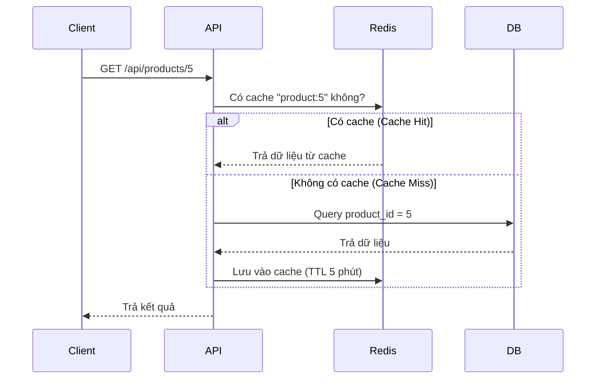
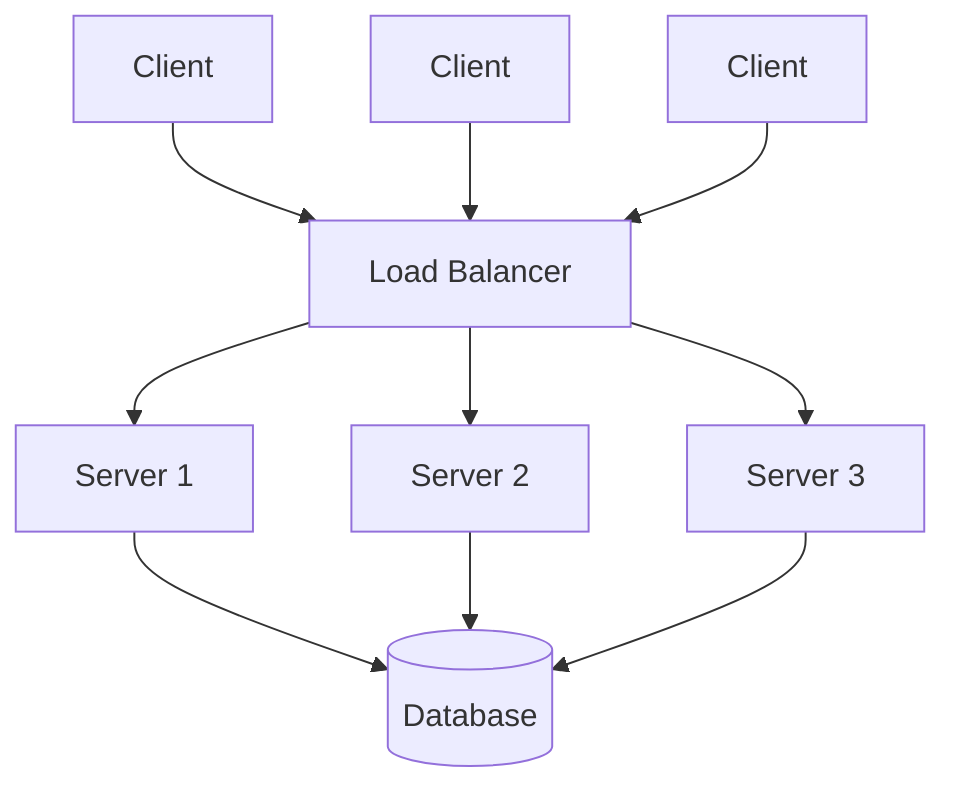
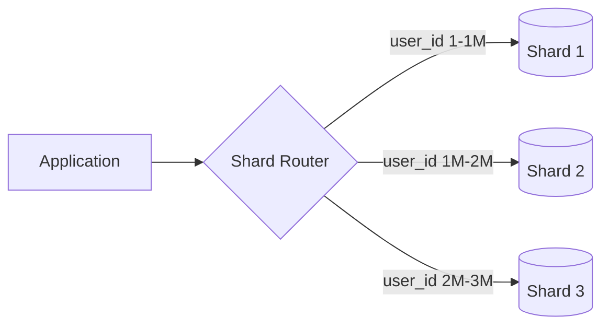
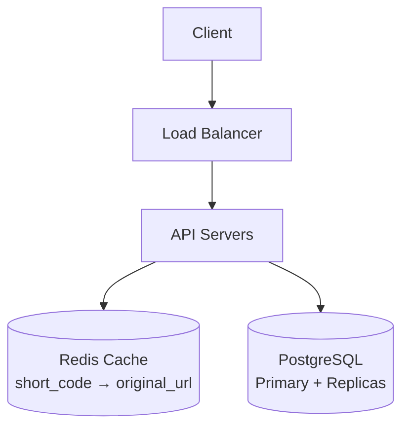

# 📘 Giai đoạn 6: Tư duy System Design

> Quay lại: [Roadmap tổng quan](./roadmap-database-system-design.md) | Trước đó: [Giai đoạn 5 — Kết nối Backend/API](./05-ket-noi-backend-api.md)

## Mục lục
- [6.1 SQL vs NoSQL — khi nào chọn loại nào](#61-sql-vs-nosql--khi-nào-chọn-loại-nào)
- [6.2 Caching với Redis](#62-caching-với-redis)
- [6.3 Load Balancing cơ bản](#63-load-balancing-cơ-bản)
- [6.4 Scaling: Vertical vs Horizontal](#64-scaling-vertical-vs-horizontal)
- [6.5 Sharding & Partitioning](#65-sharding--partitioning)
- [6.6 CAP Theorem](#66-cap-theorem)
- [6.7 Case Study: Thiết kế hệ thống rút gọn URL](#67-case-study-thiết-kế-hệ-thống-rút-gọn-url)
- [6.8 Bài tập thực hành cuối khóa](#68-bài-tập-thực-hành-cuối-khóa)
- [6.9 Tự kiểm tra cuối cùng](#69-tự-kiểm-tra-cuối-cùng)

---

## 6.1 SQL vs NoSQL — khi nào chọn loại nào

| Tiêu chí | SQL (PostgreSQL, MySQL) | NoSQL (MongoDB, Redis, Cassandra) |
|---|---|---|
| Cấu trúc dữ liệu | Có schema cố định, dạng bảng | Linh hoạt (document, key-value, wide-column) |
| Quan hệ dữ liệu | Mạnh — JOIN nhiều bảng dễ dàng | Yếu hơn — thường denormalize sẵn |
| Tính nhất quán | ACID mạnh | Thường ưu tiên tốc độ/availability hơn (tùy loại) |
| Khi nào dùng | Dữ liệu có cấu trúc rõ, cần transaction chính xác (tài chính, đơn hàng) | Dữ liệu thay đổi cấu trúc linh hoạt, cần scale ngang cực lớn (log, session, realtime feed) |

**Ví dụ thực tế:**
- Hệ thống ngân hàng → **SQL** (cần ACID chặt chẽ)
- Session cache của web app → **Redis** (key-value, tốc độ cực nhanh)
- Feed mạng xã hội với dữ liệu đa dạng → **MongoDB** (document, linh hoạt)

> Nhiều hệ thống thực tế dùng **kết hợp cả 2** (polyglot persistence): SQL cho dữ liệu lõi, NoSQL cho cache/session/log.

---

## 6.2 Caching với Redis

**Vấn đề:** Mỗi lần user request, query database tốn thời gian — nếu dữ liệu ít thay đổi, tại sao phải query lại database mỗi lần?

**Giải pháp:** Lưu kết quả vào **cache** (bộ nhớ nhanh, thường là Redis) — lần sau lấy thẳng từ cache thay vì query database.



**Chiến lược cache phổ biến:**
- **Cache-aside** (phổ biến nhất): App tự kiểm tra cache trước, miss thì query DB rồi tự lưu lại cache
- **Write-through**: Mỗi lần ghi DB, đồng thời cập nhật luôn cache
- **TTL (Time To Live)**: đặt thời gian hết hạn cho cache, tránh dữ liệu cũ (stale) tồn tại mãi

```javascript
// Ví dụ cache-aside với Redis (Node.js)
async function getProduct(id) {
  const cached = await redis.get(`product:${id}`);
  if (cached) return JSON.parse(cached);

  const product = await prisma.product.findUnique({ where: { id } });
  await redis.set(`product:${id}`, JSON.stringify(product), 'EX', 300); // TTL 5 phút
  return product;
}
```

---

## 6.3 Load Balancing cơ bản

Khi 1 server không đủ xử lý lượng truy cập lớn, ta chạy **nhiều server backend giống nhau**, và dùng **Load Balancer** để phân phối request đều ra các server.



**Thuật toán phân phối phổ biến:**
- **Round Robin** — lần lượt gửi request cho từng server theo vòng
- **Least Connections** — ưu tiên server đang xử lý ít request nhất
- **IP Hash** — cùng 1 client luôn được route tới cùng 1 server (hữu ích khi cần session sticky)

---

## 6.4 Scaling: Vertical vs Horizontal

| Loại | Cách làm | Ưu điểm | Nhược điểm |
|---|---|---|---|
| **Vertical Scaling** (scale up) | Nâng cấp server hiện tại (thêm RAM, CPU) | Đơn giản, không cần sửa kiến trúc | Có giới hạn phần cứng, downtime khi nâng cấp |
| **Horizontal Scaling** (scale out) | Thêm nhiều server chạy song song | Gần như không giới hạn, chịu lỗi tốt hơn | Phức tạp hơn (cần load balancer, đồng bộ dữ liệu) |

> Database thường khó scale horizontal hơn backend (vì dữ liệu cần nhất quán) — đây là lý do kỹ thuật **sharding** ra đời.

---

## 6.5 Sharding & Partitioning

- **Partitioning** — chia 1 bảng lớn thành nhiều phần nhỏ hơn **trên cùng 1 server** (VD: chia bảng `orders` theo tháng)
- **Sharding** — chia dữ liệu ra **nhiều server database khác nhau**, mỗi server chỉ giữ 1 phần dữ liệu (VD: user ID 1-1000000 ở server A, 1000001-2000000 ở server B)



**Đánh đổi:** Sharding giúp scale gần như vô hạn, nhưng JOIN dữ liệu giữa các shard rất khó, và cần logic routing phức tạp ở tầng ứng dụng.

---

## 6.6 CAP Theorem

Với hệ thống phân tán, bạn chỉ có thể đảm bảo **tối đa 2 trong 3** yếu tố sau cùng lúc:

- **C — Consistency**: mọi node trả về dữ liệu mới nhất giống nhau
- **A — Availability**: hệ thống luôn phản hồi request (không bị "treo")
- **P — Partition Tolerance**: hệ thống vẫn hoạt động dù mạng giữa các node bị đứt

Vì **mạng luôn có khả năng lỗi** (Partition Tolerance gần như bắt buộc phải có trong hệ phân tán thực tế), nên thực chất bài toán thường là: **chọn giữa Consistency và Availability** khi có sự cố mạng.

- Ưu tiên **CP** (Consistency + Partition tolerance): ngân hàng, giao dịch tài chính — thà từ chối phục vụ còn hơn trả dữ liệu sai
- Ưu tiên **AP** (Availability + Partition tolerance): mạng xã hội, feed tin tức — thà trả dữ liệu hơi cũ còn hơn để user không dùng được app

---

## 6.7 Case Study: Thiết kế hệ thống rút gọn URL

Đây là bài toán system design kinh điển — áp dụng toàn bộ kiến thức đã học.

**Yêu cầu:** User nhập URL dài → hệ thống trả về URL ngắn (VD: `short.ly/aZ3kT`). Khi truy cập URL ngắn → redirect về URL gốc.

### Bước 1: Thiết kế Database
```sql
CREATE TABLE urls (
    id SERIAL PRIMARY KEY,
    short_code VARCHAR(10) UNIQUE NOT NULL,
    original_url TEXT NOT NULL,
    created_at TIMESTAMP DEFAULT NOW(),
    click_count BIGINT DEFAULT 0
);
CREATE INDEX idx_short_code ON urls(short_code);
```

### Bước 2: Kiến trúc tổng thể


### Bước 3: Luồng xử lý
- **Tạo short URL:** sinh mã ngắn (VD: base62 encode từ ID tự tăng), lưu vào DB
- **Truy cập short URL (đọc rất nhiều lần):**
  1. Check Redis cache trước (vì đọc nhiều hơn ghi rất nhiều lần — tỷ lệ đọc/ghi cực lệch)
  2. Cache miss → query DB, lưu lại cache
  3. Redirect (HTTP 301/302) về `original_url`
  4. Tăng `click_count` — **không nên tăng đồng bộ ngay lúc redirect** (sẽ làm chậm response), mà nên đẩy vào hàng đợi (queue) xử lý bất đồng bộ sau

### Bước 4: Các quyết định thiết kế quan trọng (và lý do)
- Dùng **Redis cache** vì tỷ lệ đọc/ghi cực lệch (đọc nhiều hơn ghi hàng nghìn lần)
- Dùng **Read Replicas** cho DB vì lượng đọc lớn, giảm tải cho Primary
- Tăng `click_count` bất đồng bộ để không làm chậm redirect (ưu tiên trải nghiệm người dùng)
- `short_code` cần **UNIQUE + index** để tra cứu tức thì

---

## 6.8 Bài tập thực hành cuối khóa

Áp dụng toàn bộ 6 giai đoạn đã học, tự thiết kế **từ Database đến kiến trúc hệ thống** cho:

> "Xây dựng hệ thống đặt vé xem phim online. Rạp có nhiều suất chiếu (mỗi suất 1 phim, 1 khung giờ, 1 phòng chiếu với sơ đồ ghế cố định). Người dùng chọn ghế và đặt vé. Cần đảm bảo 2 người không thể đặt trùng 1 ghế cùng lúc."

Yêu cầu đầy đủ:
1. Thiết kế database (ERD + SQL schema)
2. Xác định điểm nào cần Transaction để tránh đặt trùng ghế
3. Xác định điểm nào nên dùng cache, điểm nào không nên (vì sao)
4. Vẽ sơ đồ kiến trúc tổng thể (Client → API → Cache → DB)
5. Giải thích: hệ thống này nên ưu tiên Consistency hay Availability? Vì sao?

*(Đây là bài tập mở — không có đáp án "đúng duy nhất". Việc quan trọng là bạn tự lý giải được quyết định của mình. Nếu muốn, có thể chia sẻ lại thiết kế của bạn để cùng thảo luận sâu hơn.)*

**Gợi ý định hướng (không phải đáp án đầy đủ):**
- Đặt vé trùng ghế → cần transaction + constraint UNIQUE trên `(showtime_id, seat_id)` ở bảng đặt vé, hoặc dùng lock khi kiểm tra ghế trống
- Đây là hệ thống cần **Consistency cao** (CP) vì tuyệt đối không được bán trùng 1 ghế cho 2 người — thà báo lỗi "ghế đã được đặt" còn hơn xác nhận sai
- Cache phù hợp cho: danh sách phim, danh sách suất chiếu (ít thay đổi). Không phù hợp cho: trạng thái ghế trống/đã đặt (thay đổi liên tục, cần chính xác tuyệt đối)

---

## 6.9 Tự kiểm tra cuối cùng

Nếu bạn tự tin trả lời "Có" cho tất cả các mục dưới đây, bạn đã đủ khả năng tự phân tích và thiết kế 1 hệ thống hoàn chỉnh từ database đến tech stack:

- [ ] Tôi giải thích được khi nào chọn SQL, khi nào chọn NoSQL, bằng ví dụ cụ thể
- [ ] Tôi thiết kế được chiến lược cache hợp lý cho 1 hệ thống mới (biết cái gì nên cache, cái gì không)
- [ ] Tôi giải thích được sự khác biệt Vertical Scaling và Horizontal Scaling
- [ ] Tôi hiểu khái niệm Sharding và biết đánh đổi của nó
- [ ] Tôi giải thích được CAP theorem và áp dụng được vào 1 bài toán thực tế (biết nên ưu tiên C hay A)
- [ ] Tôi tự hoàn thành được bài tập "hệ thống đặt vé xem phim" với đầy đủ 5 yêu cầu ở trên
- [ ] Tôi có thể tự tin trình bày toàn bộ thiết kế 1 hệ thống (từ ERD đến kiến trúc) trước người khác và trả lời được câu hỏi "vì sao bạn thiết kế như vậy"

---

## 🎉 Hoàn thành lộ trình

Chúc mừng bạn đã đi hết 6 giai đoạn! Bước tiếp theo để giữ vững và nâng cao kỹ năng:
- Tham gia thiết kế database cho 1 dự án thật (cá nhân hoặc đóng góp mã nguồn mở)
- Đọc sách **"Designing Data-Intensive Applications"** để đào sâu hơn về hệ thống dữ liệu quy mô lớn
- Luyện thêm các case study trên [System Design Primer](https://github.com/donnemartin/system-design-primer)

> Quay lại: [Roadmap tổng quan](./roadmap-database-system-design.md)
