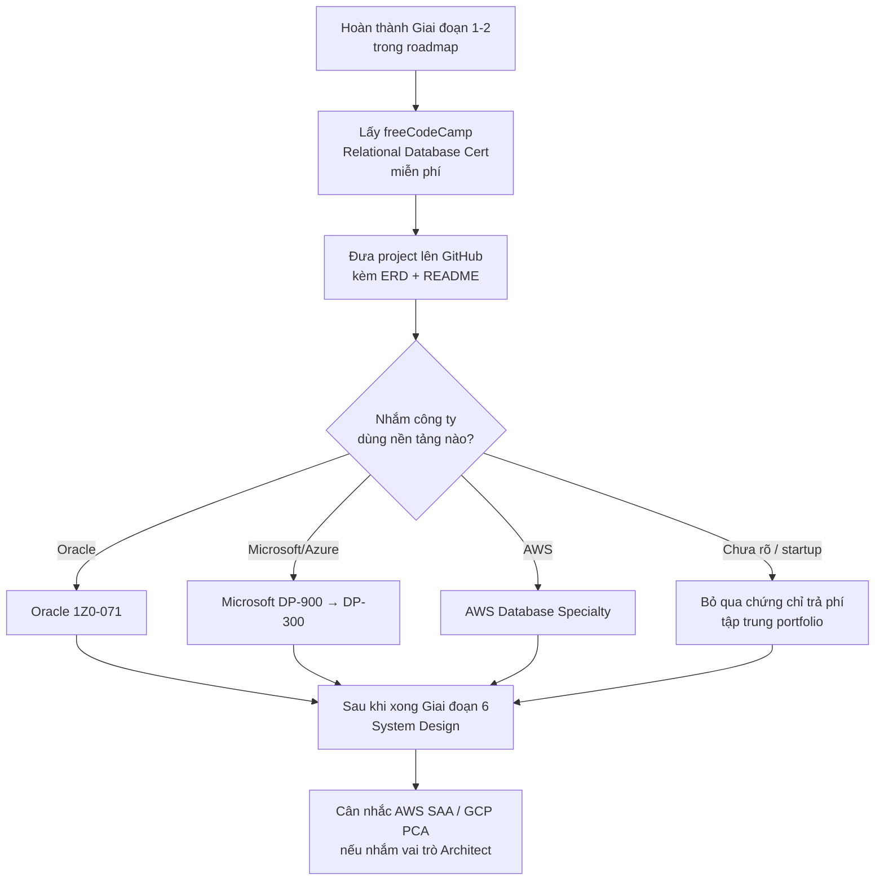

# 📘 Phụ lục: Chứng chỉ Database & System Design cho Portfolio

> Quay lại: [Roadmap tổng quan](./roadmap-database-system-design.md) | Trước đó: [Giai đoạn 6 — Tư duy System Design](./06-system-design.md)

## Mục lục
- [Sự thật cần biết trước khi đầu tư tiền](#sự-thật-cần-biết-trước-khi-đầu-tư-tiền)
- [Nhóm chứng chỉ Database](#nhóm-chứng-chỉ-database)
- [Nhóm chứng chỉ System Design / Kiến trúc hệ thống](#nhóm-chứng-chỉ-system-design--kiến-trúc-hệ-thống)
- [Lộ trình gợi ý theo ngân sách](#lộ-trình-gợi-ý-theo-ngân-sách)
- [Checklist portfolio hoàn chỉnh](#checklist-portfolio-hoàn-chỉnh)

---

## Sự thật cần biết trước khi đầu tư tiền

Với vai trò dev/kỹ sư phần mềm, **portfolio dự án thật quan trọng hơn chứng chỉ**:
- Startup gần như chỉ nhìn bạn đã build được gì
- Các công ty lớn (FAANG) tuyển dựa trên phỏng vấn system design trực tiếp, không dựa trên bằng cấp
- Chứng chỉ chủ yếu hữu ích để:
  - Lọt qua vòng lọc hồ sơ tự động (ATS) ở công ty lớn
  - Chứng minh khớp đúng công nghệ công ty đang dùng (VD: ứng tuyển công ty dùng Oracle → có 1Z0-071 sẽ lợi thế)

> Chiến lược tốt nhất: **kết hợp** — lấy 1-2 chứng chỉ miễn phí/rẻ để qua vòng lọc hồ sơ, đồng thời đầu tư chính vào portfolio dự án thật trên GitHub.

---

## Nhóm chứng chỉ Database

Đây là nhóm có kỳ thi và bằng cấp rõ ràng:

| Chứng chỉ | Nhà cung cấp | Chi phí | Phù hợp khi |
|---|---|---|---|
| freeCodeCamp Relational Database Certification | freeCodeCamp | Miễn phí | Mới bắt đầu, muốn có chứng chỉ đầu tiên không tốn tiền |
| HackerRank SQL (Basic/Advanced) Skill Badge | HackerRank | Miễn phí | Badge nhanh, gắn LinkedIn, nhiều công ty chấp nhận |
| Microsoft DP-900 (Azure Data Fundamentals) | Microsoft | ~$99, không hết hạn | Muốn 1 chứng chỉ nền tảng, làm hồ sơ ứng tuyển đẹp hơn |
| Oracle 1Z0-071 (SQL Certified Associate) | Oracle | ~$245, cần thi lại 18-24 tháng | Công ty dùng Oracle DB (ngân hàng, tập đoàn lớn) |
| Microsoft DP-300 (Azure Database Administrator) | Microsoft | ~$165 | Công ty dùng hạ tầng Microsoft/Azure |
| AWS Certified Database – Specialty | AWS | ~$300 | Đã có kinh nghiệm, muốn chuyên sâu AWS RDS/DynamoDB/Aurora |
| EDB PostgreSQL Associate | EnterpriseDB | Có phí, không hết hạn | Chuyên PostgreSQL cụ thể |

---

## Nhóm chứng chỉ System Design / Kiến trúc hệ thống

Không có kỳ thi "System Design" chính thức nào — nhóm gần nhất là các chứng chỉ Cloud Architect, vì chúng đánh giá đúng tư duy thiết kế hệ thống quy mô lớn:

- **AWS Certified Solutions Architect – Associate (SAA-C03)** rồi lên **Professional (SAP-C02)** — được xem là "chuẩn vàng" chứng minh khả năng thiết kế hệ thống quy mô lớn
- **Google Cloud Professional Cloud Architect** — đề thi dùng case study thực tế (VD: EHR Healthcare, Mountkirk Games), đánh giá tư duy kiến trúc thật sự chứ không chỉ thuộc bài
- **Microsoft Azure Solutions Architect Expert (AZ-305)** — nếu công ty dùng Azure

---

## Lộ trình gợi ý theo ngân sách

---

## Checklist portfolio hoàn chỉnh

- [ ] Có ít nhất 1 chứng chỉ miễn phí (freeCodeCamp hoặc HackerRank badge) gắn trên LinkedIn/CV
- [ ] Có tối thiểu 2-3 project database thực tế trên GitHub (từ [Dự án thực hành đề xuất](./roadmap-database-system-design.md#dự-án-thực-hành-đề-xuất) trong roadmap)
- [ ] Mỗi project có README giải thích: yêu cầu nghiệp vụ, ERD, lý do các quyết định thiết kế (vì sao chuẩn hóa/denormalize, vì sao chọn SQL/NoSQL...)
- [ ] Có ít nhất 1 project kết nối đủ Database → Backend API → có thể demo được
- [ ] Nếu nhắm công ty cụ thể, đã chọn đúng 1 chứng chỉ khớp nền tảng công ty đó dùng
- [ ] Có thể trình bày lại toàn bộ 1 project trước người khác và trả lời câu hỏi "vì sao bạn thiết kế như vậy"

> Quay lại: [Roadmap tổng quan](./roadmap-database-system-design.md)
