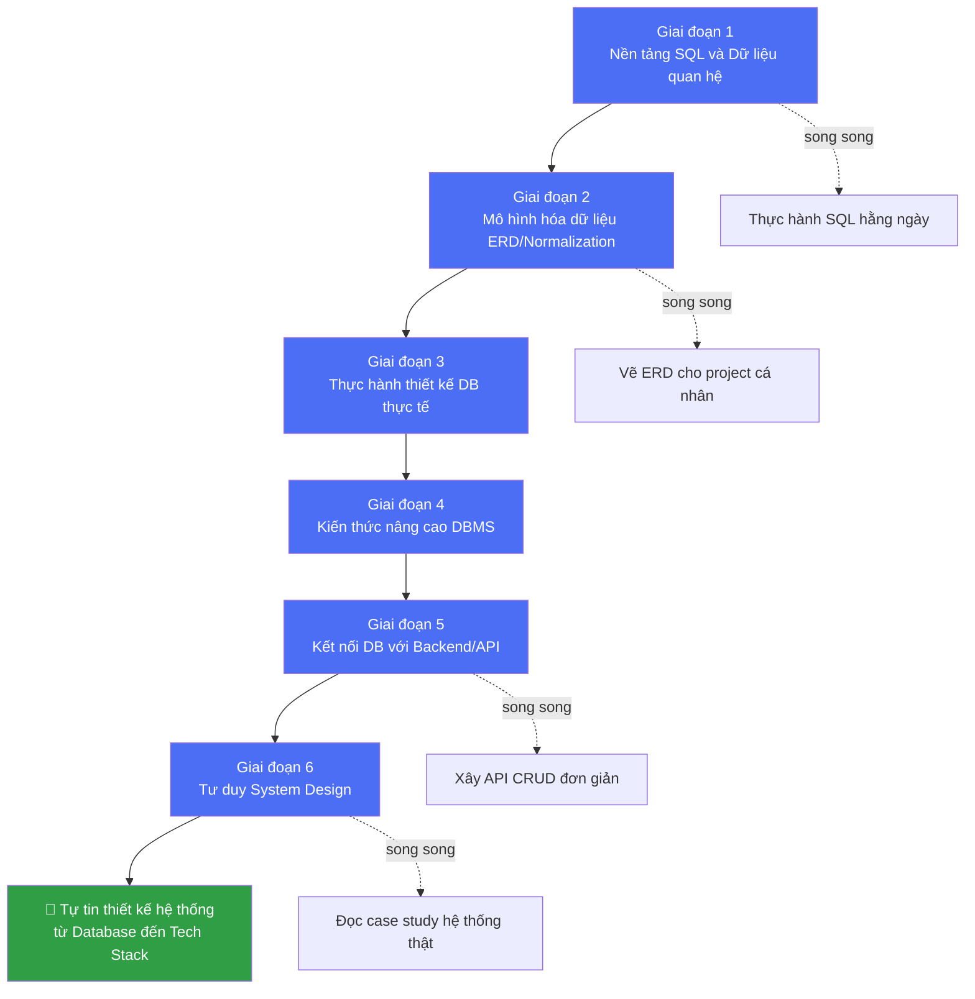
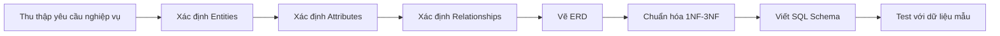
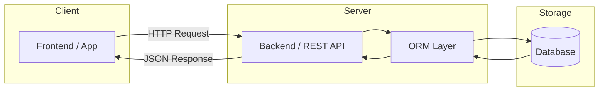

# 🗺️ Roadmap: Từ Database đến Thiết Kế Hệ Thống (Cho Người Mới)

> Lộ trình học phân tích & thiết kế database, đủ để tự tin thiết kế một hệ thống hoàn chỉnh từ database đến tech stack.

---

## 📌 Mục lục (Overview)

- [Tổng quan lộ trình (Mermaid Flow)](#tổng-quan-lộ-trình-mermaid-flow)
- [Giai đoạn 1: Nền tảng dữ liệu quan hệ](#giai-đoạn-1-nền-tảng-dữ-liệu-quan-hệ)
- [Giai đoạn 2: Mô hình hóa dữ liệu (Data Modeling)](#giai-đoạn-2-mô-hình-hóa-dữ-liệu-data-modeling)
- [Giai đoạn 3: Thực hành thiết kế database thực tế](#giai-đoạn-3-thực-hành-thiết-kế-database-thực-tế)
- [Giai đoạn 4: Kiến thức nâng cao về DBMS](#giai-đoạn-4-kiến-thức-nâng-cao-về-dbms)
- [Giai đoạn 5: Kết nối Database với Backend/API](#giai-đoạn-5-kết-nối-database-với-backendapi)
- [Giai đoạn 6: Tư duy System Design](#giai-đoạn-6-tư-duy-system-design)
- [Dự án thực hành đề xuất](#dự-án-thực-hành-đề-xuất)
- [Checklist kỹ năng khi hoàn thành](#checklist-kỹ-năng-khi-hoàn-thành)
- [Tổng hợp tài liệu tham khảo](#tổng-hợp-tài-liệu-tham-khảo)

**📚 Bài học chi tiết (mở file riêng để học sâu từng phần):**
1. [Nền tảng dữ liệu quan hệ & SQL](./01-nen-tang-sql.md)
2. [Mô hình hóa dữ liệu (Data Modeling)](./02-mo-hinh-hoa-du-lieu.md)
3. [Thực hành thiết kế Database thực tế](./03-thuc-hanh-thiet-ke-db.md)
4. [Kiến thức nâng cao về DBMS](./04-dbms-nang-cao.md)
5. [Kết nối Database với Backend/API](./05-ket-noi-backend-api.md)
6. [Tư duy System Design](./06-system-design.md)

---

## Tổng quan lộ trình (Mermaid Flow)

---

## Giai đoạn 1: Nền tảng dữ liệu quan hệ

📄 **[Xem bài học chi tiết →](./01-nen-tang-sql.md)**

**Thời gian gợi ý:** 2–3 tuần

### Mục tiêu
- Hiểu database quan hệ là gì: bảng, hàng, cột, kiểu dữ liệu
- Nắm khái niệm khóa chính (Primary Key), khóa ngoại (Foreign Key)
- Thành thạo SQL cơ bản

### Nội dung cần học
1. Khái niệm RDBMS (Relational Database Management System)
2. Câu lệnh `SELECT`, `WHERE`, `ORDER BY`, `GROUP BY`, `HAVING`
3. Các loại `JOIN`: INNER, LEFT, RIGHT, FULL OUTER
4. Subquery cơ bản
5. `INSERT`, `UPDATE`, `DELETE`, `CREATE TABLE`, `ALTER TABLE`

### Công cụ thực hành
- Cài đặt **PostgreSQL** (khuyên dùng vì mạnh, miễn phí, chuẩn SQL tốt) hoặc MySQL
- Dùng **DBeaver** hoặc **pgAdmin** làm GUI quản lý database

---

## Giai đoạn 2: Mô hình hóa dữ liệu (Data Modeling)

📄 **[Xem bài học chi tiết →](./02-mo-hinh-hoa-du-lieu.md)**

**Thời gian gợi ý:** 2–3 tuần — *đây là phần cốt lõi của "phân tích và thiết kế database"*

### Mục tiêu
- Biết cách phân tích một bài toán thực tế thành các thực thể (entity) và mối quan hệ
- Thiết kế được database chuẩn hóa, tránh dư thừa dữ liệu

### Nội dung cần học
1. **Entity-Relationship Diagram (ERD)**
   - Entity, Attribute, Relationship
   - Quan hệ 1-1, 1-n, n-n
   - Cardinality & Participation constraints
2. **Chuẩn hóa dữ liệu (Normalization)**
   - 1NF, 2NF, 3NF, BCNF
   - Hiểu vì sao và khi nào cần chuẩn hóa
3. **Denormalization**
   - Khi nào nên "phá chuẩn" để tối ưu hiệu năng đọc dữ liệu
4. **Các ràng buộc dữ liệu (Constraints)**
   - UNIQUE, NOT NULL, CHECK, DEFAULT

### Công cụ vẽ ERD
- [dbdiagram.io](https://dbdiagram.io) — vẽ ERD bằng code, xuất SQL trực tiếp
- [draw.io](https://app.diagrams.net) — vẽ ERD kéo thả
- MySQL Workbench (built-in ERD tool)

---

## Giai đoạn 3: Thực hành thiết kế database thực tế

📄 **[Xem bài học chi tiết →](./03-thuc-hanh-thiet-ke-db.md)**

**Thời gian gợi ý:** 2–4 tuần

### Cách thực hành
1. Chọn 1 bài toán quen thuộc (xem [Dự án thực hành đề xuất](#dự-án-thực-hành-đề-xuất))
2. Viết ra yêu cầu nghiệp vụ (business requirements)
3. Xác định danh sách entity và thuộc tính
4. Vẽ ERD
5. Chuẩn hóa tới 3NF (hoặc quyết định denormalize có lý do)
6. Viết SQL script tạo schema (`CREATE TABLE`)
7. Insert dữ liệu mẫu, viết các query truy vấn phức tạp mô phỏng nghiệp vụ thật

### Ví dụ flow phân tích 1 bài toán

---

## Giai đoạn 4: Kiến thức nâng cao về DBMS

📄 **[Xem bài học chi tiết →](./04-dbms-nang-cao.md)**

**Thời gian gợi ý:** 2 tuần

### Nội dung cần học
- **Index**: B-Tree index, khi nào nên/không nên đánh index
- **Transaction & ACID**: Atomicity, Consistency, Isolation, Durability
- **Isolation levels**: Read Committed, Repeatable Read, Serializable
- **Query optimization**: đọc `EXPLAIN`/`EXPLAIN ANALYZE`
- **Backup & Replication** cơ bản (Master-Slave)

---

## Giai đoạn 5: Kết nối Database với Backend/API

📄 **[Xem bài học chi tiết →](./05-ket-noi-backend-api.md)**

**Thời gian gợi ý:** 3–4 tuần

### Mục tiêu
Đây là bước chuyển từ "biết thiết kế DB" sang "biết thiết kế hệ thống".

### Nội dung cần học
1. Chọn 1 backend stack để học sâu:
   - **Node.js + Express** (JavaScript, dễ tiếp cận)
   - **Python + Django/FastAPI**
   - **Java + Spring Boot**
2. **ORM (Object-Relational Mapping)**
   - Prisma, Sequelize (Node.js) / SQLAlchemy (Python) / Hibernate (Java)
   - Hiểu ORM giúp gì và khi nào nên viết raw SQL thay vì ORM
3. Thiết kế **REST API** kết nối tới database (CRUD)
4. Kiến trúc 3 lớp cơ bản: **Database → Backend/API → Frontend**

---

## Giai đoạn 6: Tư duy System Design

📄 **[Xem bài học chi tiết →](./06-system-design.md)**

**Thời gian gợi ý:** Học liên tục, không giới hạn — càng thực hành nhiều case study càng vững

### Nội dung cần học
- **SQL vs NoSQL**: khi nào chọn loại nào (MongoDB, Redis, Cassandra...)
- **Caching**: Redis, chiến lược cache-aside, write-through
- **Load Balancing** cơ bản
- **Horizontal vs Vertical Scaling**
- **Database Sharding & Partitioning** (khái niệm)
- **CAP Theorem** — hiểu đánh đổi giữa Consistency, Availability, Partition tolerance

---

## Dự án thực hành đề xuất

Chọn 1 trong các project sau để áp dụng toàn bộ lộ trình trên (từ dễ đến khó):

1. **Hệ thống quản lý thư viện** (dễ) — Sách, Độc giả, Mượn/Trả
2. **Hệ thống bán hàng online** (trung bình) — Sản phẩm, Đơn hàng, Khách hàng, Kho
3. **Hệ thống đặt phòng khách sạn** (trung bình-khó) — Phòng, Đặt phòng, Thanh toán, tránh trùng lịch
4. **Mạng xã hội mini** (khó) — User, Post, Comment, Like, Follow (quan hệ n-n phức tạp)

---

## Checklist kỹ năng khi hoàn thành

- [ ] Viết thành thạo SQL: SELECT, JOIN, subquery, aggregate
- [ ] Tự phân tích 1 bài toán nghiệp vụ ra danh sách entity/attribute/relationship
- [ ] Vẽ được ERD chuẩn cho hệ thống có ít nhất 5-7 bảng
- [ ] Chuẩn hóa dữ liệu tới 3NF, biết khi nào denormalize
- [ ] Hiểu và áp dụng index, transaction cơ bản
- [ ] Kết nối được database với 1 backend framework qua ORM
- [ ] Xây dựng REST API CRUD hoàn chỉnh
- [ ] Giải thích được sự khác biệt SQL vs NoSQL và khi nào dùng loại nào
- [ ] Đọc hiểu và tự vẽ được sơ đồ kiến trúc hệ thống đơn giản (DB - API - Frontend)

---

## Tổng hợp tài liệu tham khảo

### Học SQL
- [SQLBolt](https://sqlbolt.com/) — Học SQL tương tác ngay trên trình duyệt, phù hợp người mới
- [Mode SQL Tutorial](https://mode.com/sql-tutorial/) — Học SQL theo hướng phân tích dữ liệu thực tế
- [PostgreSQL Official Documentation](https://www.postgresql.org/docs/) — Tài liệu chính thức, đáng tin cậy nhất khi làm việc với PostgreSQL

### Data Modeling & Normalization
- [dbdiagram.io Docs](https://docs.dbdiagram.io/) — Công cụ vẽ ERD bằng code (DBML)
- [freeCodeCamp - Learn Relational Database Design](https://www.freecodecamp.org/news/learn-relational-database-design/) — Khóa học miễn phí, bao gồm SQL, ER modeling, chuẩn hóa (1NF-BCNF), indexing

### DBMS nâng cao
- [Use The Index, Luke](https://use-the-index-luke.com/) — Tài liệu chuyên sâu, miễn phí về index và tối ưu SQL
- [PostgreSQL - Indexes](https://www.postgresql.org/docs/current/indexes.html) — Tài liệu chính thức về index trong Postgres

### Backend & ORM
- [Prisma Documentation](https://www.prisma.io/docs) — ORM hiện đại cho Node.js/TypeScript
- [Django Official Documentation](https://docs.djangoproject.com/) — Framework Python phổ biến, có ORM mạnh sẵn

### System Design
- [The System Design Primer (GitHub)](https://github.com/donnemartin/system-design-primer) — Repo tổng hợp kiến thức system design được cộng đồng đánh giá cao, miễn phí
- Sách **"Designing Data-Intensive Applications"** của Martin Kleppmann — được xem là sách gối đầu giường cho ai muốn hiểu sâu về hệ thống dữ liệu quy mô lớn

---

*Lộ trình này được thiết kế để đi từ số 0 đến có thể tự tin thiết kế 1 hệ thống hoàn chỉnh. Học đến đâu, thực hành ngay đến đó — đừng học lý thuyết dồn cục rồi mới bắt tay vào project.*
